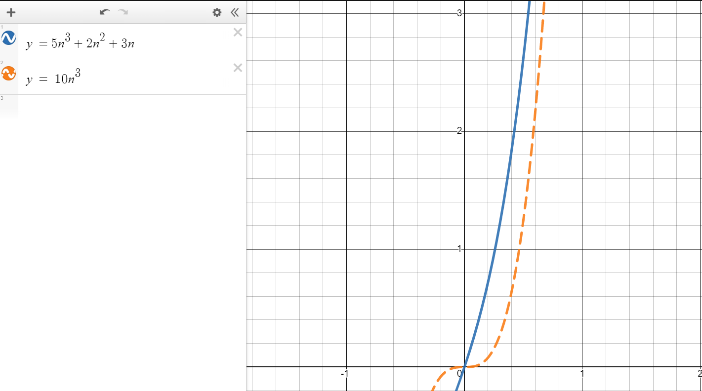

## Formal Definition

$T(N) = O(f(N))$ if there are positive constants $c$ and $n_0$ such that $T(N) \leq cf(N)$ when $N \geq n_0$

The growth rate of $T(N)$ is __less than or equal to__ that of $f(N)$.

## Showing Big O

For $T(n) = 5n^3 + 2n^2 + 3n$, we will show $T(n) \leq O(n^2)$.

$$
\begin{aligned}
5n^3 + 2n^2 + 3n &\leq 5n^3 + 2n^2 + 3n \\
&= 5n^3 + 2n^3 + 3n^3 \\
&= 10n^3\\
&= c_1n
\end{aligned}
$$

This shows that when $c_1=1$ and $n_0=1$, then for any $n\geq n_0$, $5n^3 + 2n^2 + 3n \leq O(n^2)$

## Graphing Big O

This graph is based on the expression presented above. [Direct link to graph in Desmos](https://www.desmos.com/calculator/p0ew5pbpbe).