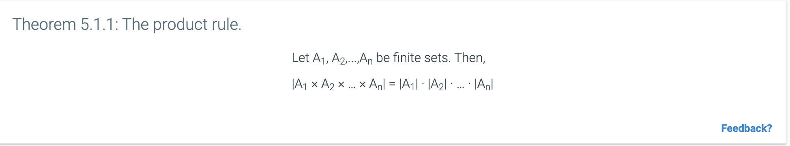

The __product rule__ provides a way for us to count sequences.

It can also be used as a means for counting strings in a sequence. For example the number of binary strings of length n is $2^n$.

The product rule can also be used on strings that are restricted to characters. For instance, imagine a string of characters {0, 1} and a structure of $0 * * * 0$ where * is a character that can be 0 or 1.

Applying the product rule for this would result in 1 * 2 * 2 * 1 = 8.

Additionally, the product rule can also be referred to as the __multiplicative principal__. This principal states that if event __A__ can occur in _m_ ways, and each possibility of __A__ allows for exactly _n_ ways for event __B__, then the event "__A__ and __B__" can occur in _m_*_n_ ways.