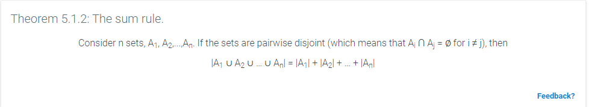

The __sum rule__ is applied when there are multiple choices but only one selection is made.

The sum rule can also be referred to as the __additive principle__.

The additive principal states that if event __A__ can occur in _m_ ways, and event __B__ can occur in _n_ disjoint ways, then the event "__A__ or __B__" can occur in _m + n_ ways.